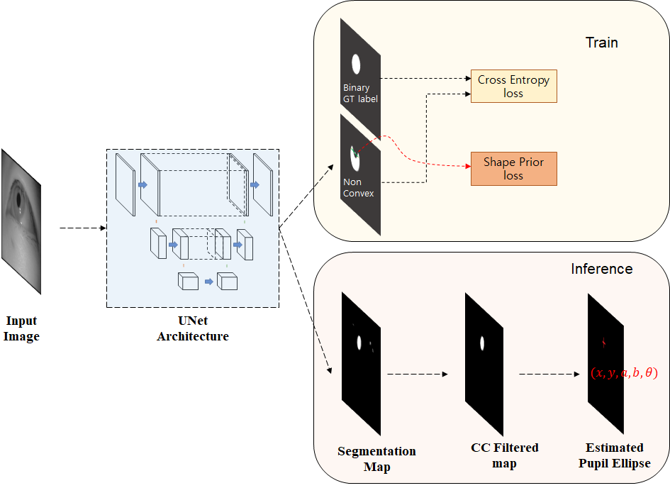
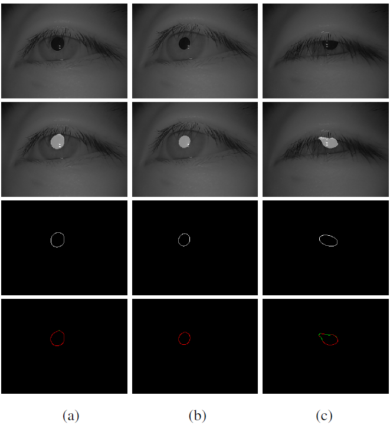
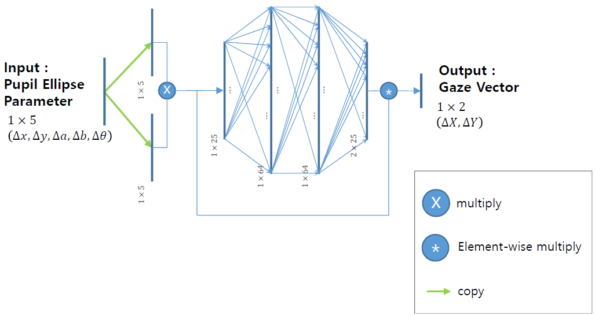
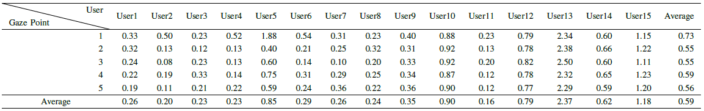
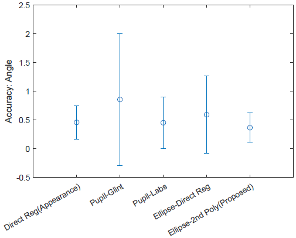
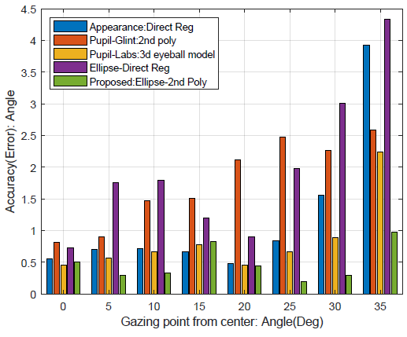

# User-Independent Gaze Estimation by Extracting Pupil Parameter and Its Mapping to the Gaze Angle

Sang Yoon Han, and Nam Ik Cho

[[Paper]](https://not_yet)

## Environments
- Windows 10
- [Tensorflow 1.13](http://www.tensorflow.org/)
- [Pytorch 1.1](https://pytorch.org/)
- CUDA 9.0.176 & cuDNN 7.3.1
- Python 3.6.8
- Pupil Labs Eye Tracker (Need USB 3.0)
- pyuvc-0.13 (https://docs.pupil-labs.com/)

## Abstract
Since gaze estimation plays a crucial role in recognizing human intentions, it has been researched for a long time, and its accuracy is ever increasing. However, due to the wide variation in eye shapes and focusing abilities between the individuals, accuracies of most algorithms vary depending on each person in the test group, especially when the initial calibration is not well performed. To alleviate the user-dependency, we attempt to derive features that are general for most people and use them as the input to a deep network instead of using the images as the input. Specifically, we use the pupil shape as the core feature because it is directly related to the 3D eyeball rotation, and thus the gaze direction. While existing deep learning methods learn the gaze point by extracting various features from the image, we focus on the mapping function from the eyeball rotation to the gaze point by using the pupil shape as the input. It is shown that the accuracy of gaze point estimation also becomes robust for the uncalibrated points by following the characteristics of the mapping function. Also, our gaze network learns the gaze difference to facilitate the re-calibration process to fix the calibration-drift problem that typically occurs with glass-type or head-mount devices.
<br><br>

## Brief Description of Our Proposed Method

Our goal is to design a simple and light-weight network that is less susceptible to the differences in eye shapes between the individuals. For this, instead of using a huge end-to-end deep network, we split the network into two as shown in Figure below. The UNet in the left part is a pupil segmentation network from our previous research, where it is shown that the UNet provides noise-robust pupil segmentation results without depending on eye shapes. We fit the pupil region by an ellipse, and then the elliptic parameters of two consecutive image frames are fed to the second network (on the right side of the figure), which outputs the POG in the world camera coordinate system.
### <u>Overall Workflow of The Proposed Method</u>

<p align="center"></p>


### <u>Pupil segmentation results and fitting ellipse to measure ellipse confidence score. (a),(b) are considered as pupil and (c) is not considered as a pupil.</u>

<p align="center"></p>


### <u>Proposed gaze estimation network.</u>

<p align="center"></p>


## Experimental Results

**The angular error in gaze detection on each users using using proposed algorithm.**

<p align="center"></p>

**Accuracy comparison in terms of mean and variance of angle estimation error.**
<p align="center"></p>

**Accuracy comparison according to the gaze angle.**
<p align="center"></p>

<br><br>

## Guidelines for Codes

**Requisites should be installed beforehand.**

Clone this repo.

```
git clone http://github.com/jaegal88/user_independent_gaze_estimation.git
```

Install pyuvc - (to use pupil-labs eye-tracker in Windows 10)

### Test

```
python cam_read.py
```

## Dataset
Datasets are avaiable at https://github.com/jaegal88/pupil-shape-prior 

## Citation
When you use data or codes in this site,
please cite the following paper:

```
@article{han2020gazeangle,
title={User-Independent Gaze Estimation by Extracting Pupil Parameter and Its Mapping to the Gaze Angle},
author={Han, Sang Yoon and Cho, Nam Ik},
journal={ICPR 2020},
year={2020},
publisher={IAPR}
}
```
